<!-- Header with Banner -->
<!-- 

  Data Manufacturing, Data Migration, Load transition, Warm cloud instrumentation and Infra, Staff &and Architecture-cum-platform, Cloud Fabric, section prest, forward deployed, Edge AI/llms, Nobel Metal Virtual Embedded firmware, X-aves, Loab of Physical Mathematics, Game Crane Graphics, 6G Tower Area N/W(weakling+strongling sap core)

 -->

  

<!-- Subtitle under Header -->

Data Manufacturing, Data Migration, Load transition, Warm cloud instrumentation and Infra, Staff &and Architecture-cum-platform, Cloud Fabric, section prest, forward deployed, Edge AI/llms, Nobel Metal Virtual Embedded firmware, X-aves, Loab of Physical Mathematics, Game Crane Graphics, 6G Tower Area N/W(weakling+strongling sap core)

<!-- Typing Intro -->

  

<!-- Introduction -->
<h1 align="center"><samp>Hello, I'm Akshat!</samp></h1>
<h3 align="center"><samp>Serif for building.....</samp></h3>

  

<!-- Now -->
<h2><samp>Now</samp></h2>

<!-- Signals -->

  
  

<!-- Social/Links -->

  
  
  
  

<!-- Tech Stack -->
<h2><samp>Techs</samp></h2>

  <h3><samp><em>Programming</em></samp></h3>
  

    
    
    
    
    
    
  

  <h3><samp><em>Frontend</em></samp></h3>
  

    
    
    
    
  

  <h3><samp><em>Backend</em></samp></h3>
  

    
    
  

  <h3><samp><em>Databases & Cloud</em></samp></h3>
  

    
    
    
    
  

  <h3><samp><em>Design</em></samp></h3>
  

    
    
    
    
    
  

  <h3><samp><em>DevOps & Solution Architecture Ecosystem</em></samp></h3>
  

    
    
    
    
    
    
    
    
    
    
    
    
    
  

<!-- Highlight Projects -->
<h2><samp>Projects</samp></h2>
<table>
  <tr>
    <td width="50%">
      <h3 align="center"><samp>Chess Cheat Detection Engine</samp></h3>
      
      

        
        
      

      
<samp>Real‑time chess cheat detection with Stockfish, OpenCV, and TensorFlow. Dockerized with MySQL.</samp>

    </td>
    <td width="50%">
      <h3 align="center"><samp>Takes Takes Takes – Chess Game Website</samp></h3>
      
      

        
        
      

      
<samp>Two‑player chess with real‑time sync, auth, and game history via MongoDB.</samp>

    </td>
  </tr>
  <tr>
    <td width="50%">
      <h3 align="center"><samp>HereIAm – Real‑Time Chat Application</samp></h3>
      
      

        
        
      

      
<samp>Responsive chat with private/group messaging using React+Node+WebSockets+MongoDB.</samp>

    </td>
    <td width="50%"></td>
  </tr>
</table>

<!-- Pinned Repo Cards -->

  
  

<!-- GitHub Stats -->
<h2><samp>GitHub Stats</samp></h2>

  

  

  

<!-- GitHub Trophies -->
<h3 align="center"><samp>Trophies</samp></h3>

  

<!-- WakaTime -->
<h2><samp>WakaTime</samp></h2>

  

<!-- Activity Graph -->

  

<!-- Activity breakdown -->

  

<!-- Extra Metrics -->

  
<samp>Extra metrics</samp>

  

    
  

<!-- LeetCode Card -->

  

<!-- Dev Quote -->

<!-- Dev Joke -->

  

<!-- Contact -->
<h2><samp>Basic deeds</samp></h2>

  
  
  
  

<!-- Footer Wave -->

  

<!-- Snake -->
<picture>
  <source media="(prefers-color-scheme: dark)" srcset="https://raw.githubusercontent.com/tobiasmeyhoefer/tobiasmeyhoefer/output/github-snake-dark.svg"/>
  <source media="(prefers-color-scheme: light)" srcset="https://raw.githubusercontent.com/tobiasmeyhoefer/tobiasmeyhoefer/output/github-snake.svg"/>
  
</picture>
