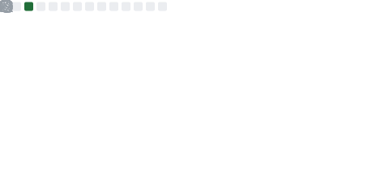

<!-- Header with Banner -->
<!-- 

  Data Manufacturing, Data Migration, Load transition, Warm cloud instrumentation and Infra, Staff &and Architecture-cum-platform, Cloud Fabric, section prest, forward deployed, Edge AI/llms, Nobel Metal Virtual Embedded firmware, X-aves, Loab of Physical Mathematics, Game Crane Graphics, 6G Tower Area N/W(weakling+strongling sap core)

 -->

  

<!-- Subtitle under Header -->

  <samp>
    Data Manufacturing, Data Migration, and Data Mining 
    Load Transition, Warm Cloud Instrumentation, Infrastructure, and Cloud Fabric 
    Staff Architecture-cum-Platform, Section Prest, and Forward Deployed Systems 
    Edge AI/LLMs, Nobel Metal Virtual Embedded Firmware, X-aves, and Loab of Physical Mathematics 
    Game Crane Graphics and 6G Tower Area N/W
    (weakling + strongling sap core)
  </samp>

 
<!-- Quick Badges -->

  
  
  
  
  
  

 
<!-- Quick Links -->

  <kbd><a href="#techs">Techs</a></kbd>
  &nbsp;
  <kbd><a href="#projects">Projects</a></kbd>
  &nbsp;
  <kbd><a href="#github-stats">GitHub Stats</a></kbd>
  &nbsp;
  <kbd><a href="#activity-overview">Activity Overview</a></kbd>
  &nbsp;
  <kbd><a href="#wakatime">WakaTime</a></kbd>
  &nbsp;
  <kbd><a href="#basic-deeds">Basic Deeds</a></kbd>
   
  <samp>Jump into the profile sections</samp>
  

<!-- Typing Intro -->

  

<!-- Introduction -->
<h1 align="center"><samp>Hello, I'm Akshat!</samp></h1>
<h3 align="center"><samp>Serif for building.....</samp></h3>

  

<!-- Now -->
 
<h2 align="center"><samp>Now</samp></h2>

<!-- Signals -->
<table width="100%">
  <tr>
    <td width="50%" align="center" valign="middle">
      
      
    </td>
    <td width="50%" align="center" valign="middle">
      
      
      
      
    </td>
  </tr>
</table>

<!-- Tech Stack -->

 
<h2 align="center"><samp>Techs</samp></h2>
<table width="100%">
  <tr>
    <td width="50%" align="center" valign="top">
      <h3><samp><em>Programming</em></samp></h3>
      

        
        
        
        
        
        
      

    </td>
    <td width="50%" align="center" valign="top">
      <h3><samp><em>Frontend</em></samp></h3>
      

        
        
        
        
      

    </td>
  </tr>
  <tr>
    <td width="50%" align="center" valign="top">
      <h3><samp><em>Backend</em></samp></h3>
      

        
        
      

    </td>
    <td width="50%" align="center" valign="top">
      <h3><samp><em>Databases & Cloud</em></samp></h3>
      

        
        
        
        
        
      

    </td>
  </tr>
  <tr>
    <td width="50%" align="center" valign="top">
      <h3><samp><em>Taking a step in new phase</em></samp></h3>
      

        
        
      

    </td>
    <td width="50%" align="center" valign="top">
      <h3><samp><em>Design</em></samp></h3>
      

        
        
        
        
        
      

    </td>
  </tr>
  <tr>
    <td colspan="2" align="center" valign="top">
      <h3><samp><em>DevOps & Solution Architecture Ecosystem</em></samp></h3>
      

        
        
        
        
        
        
        
        
        
        
        
        
        
      

    </td>
  </tr>
</table>

<!-- Highlight Projects -->

 
<h2 align="center"><samp>Projects</samp></h2>
<table width="100%">
  <tr>
    <td width="50%" valign="top">
      <h3 align="center"><samp>Chess Cheat Detection Engine</samp></h3>
      
      

        
        
      

      
Real‑time chess cheat detection with Stockfish, OpenCV, and TensorFlow. Dockerized with MySQL.

    </td>
    <td width="50%" valign="top">
      <h3 align="center"><samp>Takes Takes Takes – Chess Game Website</samp></h3>
      
      

        
        
      

      
Two‑player chess with real‑time sync, auth, and game history via MongoDB.

    </td>
  </tr>
  <tr>
    <td colspan="2" align="center" valign="top">
      <h3 align="center"><samp>HereIAm – Real‑Time Chat Application</samp></h3>
      
      

        
        
      

      
Responsive chat with private/group messaging using React+Node+WebSockets+MongoDB.

    </td>
  </tr>
</table>

<!-- Pinned Repo Cards -->
 
<table width="100%">
  <tr>
    <td width="50%" align="center" valign="top">
      <a href="https://github.com/akshatsinha0/chess-cheat-detect">
        <strong><samp>chess-cheat-detect</samp></strong>
      </a>
        
      
      
    </td>
    <td width="50%" align="center" valign="top">
      <a href="https://github.com/akshatsinha0/takestakestakes-chessified">
        <strong><samp>takestakestakes-chessified</samp></strong>
      </a>
        
      
      
    </td>
  </tr>
</table>

<!-- GitHub Stats -->

 
<h2 align="center"><samp>GitHub Stats</samp></h2>

  
  
  
    
  

 

<table width="100%">
  <tr>
    <td width="50%" align="center" valign="top">
      <h3 align="center"><samp>Top Languages</samp></h3>
      
      
      
      
      
      
    </td>
    <td width="50%" align="center" valign="top">
      <h3 align="center"><samp>Trophies</samp></h3>
      
      
      
      
    </td>
  </tr>
</table>

<!-- Activity Overview -->

 
<h2 align="center"><samp>Activity overview</samp></h2>

  

<!-- WakaTime -->

 
<h2 align="center"><samp>WakaTime</samp></h2>

  

<!-- Activity Graph -->
 

  

<!-- Activity breakdown -->

  

<!-- Extra Metrics -->

  

    <samp><strong>Extra metrics</strong></samp>
  

   
  

    

      
      
      
    

    
      <samp>
        A satirical-but-sourced activity imprint: achievements, notable signals,
        and profile provenance folded into one quiet card.
      </samp>
    
      
    
  

<!-- LeetCode Card -->
 
<table width="100%">
  <tr>
    <td width="50%" align="center" valign="middle">
      
    </td>
    <td width="50%" align="center" valign="middle">
      
    </td>
  </tr>
</table>

<!-- Dev Quote -->

  

<!-- Contact -->

 
<h2 align="center"><samp>Basic deeds</samp></h2>

  
  
  
  

<!-- Footer Wave -->

  

<!-- Snake -->

  <picture>
    <source media="(prefers-color-scheme: dark)" srcset="https://raw.githubusercontent.com/tobiasmeyhoefer/tobiasmeyhoefer/output/github-snake-dark.svg"/>
    <source media="(prefers-color-scheme: light)" srcset="https://raw.githubusercontent.com/tobiasmeyhoefer/tobiasmeyhoefer/output/github-snake.svg"/>
    
  </picture>

